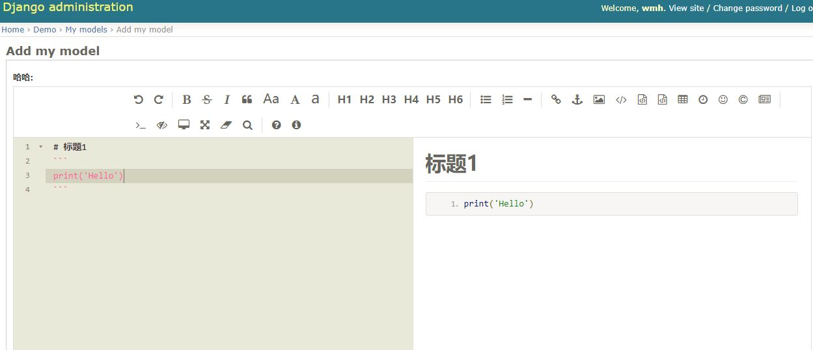

# Description
This is a  markdown editor supported for Django.
It's base the open source markdown editor [editor.md](http://pandao.github.io/editor.md/)
for javascript.

# Install 
    pip install django-markdown-editor
    
# Basic settings

Add "markdown_editor" to your INSTALLED_APPS setting like this:
 ```
 INSTALLED_APPS = [
    '''
    'markdown_editor',
]
```

Include the markdown_editor URLconf in your project urls.py like this:

    path('markdown_editor/', include('markdown_editor.urls'))


if image upload needed add this to setting

    MEDIA_URL = '/media/'
    MEDIA_ROOT = os.path.join(BASE_DIR, 'media_root') 
    
make sure image can be fetch you should add below code to you urls

    urlpatterns += static(settings.MEDIA_URL, document_root=settings.MEDIA_ROOT)
    
# Example
demo.models
    
    class MyModel(models.Model):
        name = models.TextField('哈哈')
     
demo.admins

    class TestAdmin(admin.ModelAdmin):
    formfield_overrides = {
        models.TextField: {'widget': AdminMarkdownWidget()},
    }


    admin.site.register(MyModel, TestAdmin)     

        
and excute 

    python manage.py makemigrations demo
    python manage.py migrate demo
    
view django admin


